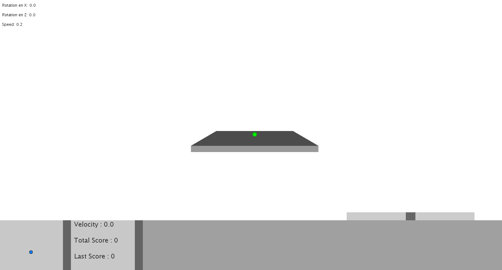
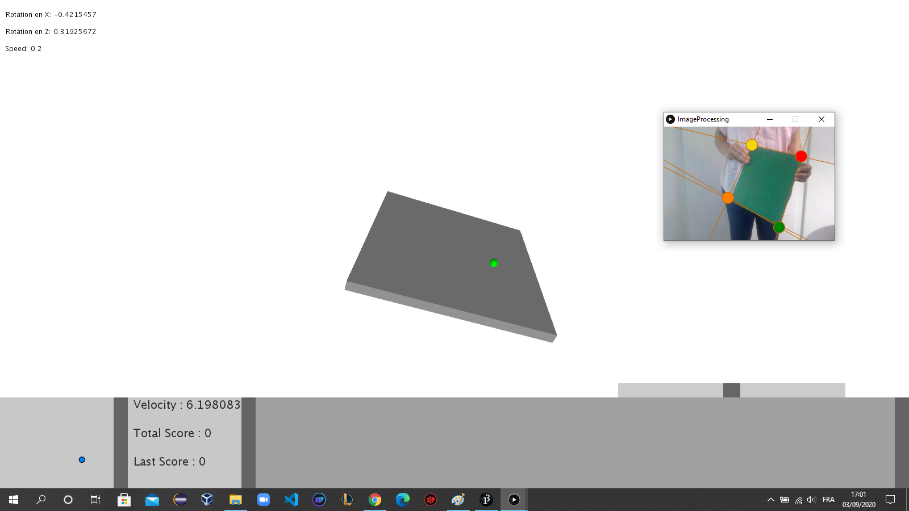
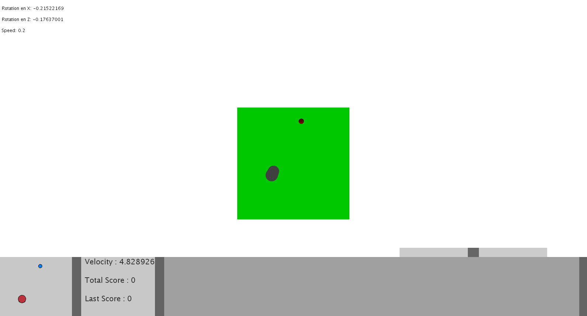
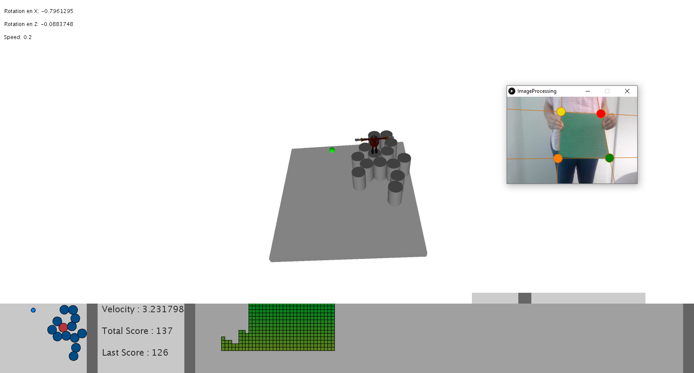

# Tangible_Game
->Description:

This is a tangible game developed during introduction to computer vision (CS211) course at EPFL.

The game works as follows

=>When running the main Processing sketch TangibleGame.pde, it will:

    • Show a plate at the centre of the screen, with the sphere initially at the centre of it. The plate will
      tilt according to the movement of the board that the code reads from the video, and the sphere will
      roll on it naturally

    • Show some data visualisation elements

    • Show the video augmented with detected lines and corners on a separate displaying window (the
      ImageProcessing window).

    • By pressing SHIFT, enter the object placement mode which allows the user to add the opponent particles
      emitter at the click’s location on the plate. It is possible to enter this mode multiple times during the game.

->Images from the game: 

